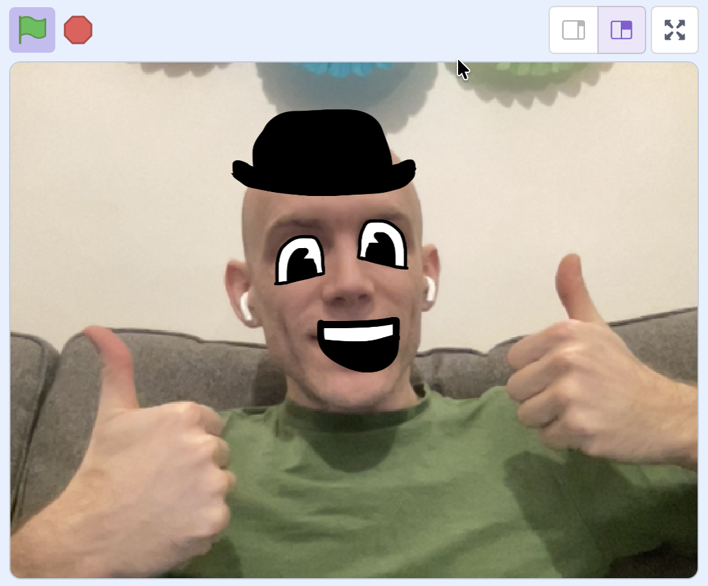

## What you will make

Use the Face Sensing tools in Scratch to make a super-simple “selfie filter” project!

You will make an accessory sprite (like a hat, glasses, or earrings) that:

- Sticks to your face
- Tilts and resizes when you move your head
- Can be duplicated to follow your nose, mouth, ears, eyes, and more.

You will need a **webcam** to complete this project.

You will need:

- A computer with a webcam (built-in or plugged in)
- Internet access
- Scratch (you can use it without signing in, but signing in lets you save)

--- collapse ---
---
title: Where are my images stored?
---

- Face Sensing works on your device.
- Your webcam images are not stored or sent to Scratch or other sites.
- The model is not trained on your video while you use it.

--- /collapse ---
