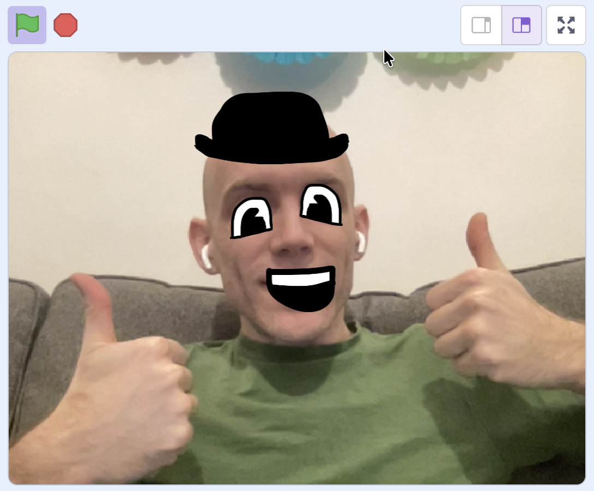

## What you will make

Use the **Face Sensing** tools in Scratch to make a fun selfie filter project.

You will make an accessory sprite (like a hat, glasses, or earrings) that:

- Sticks to your face
- Tilts and resizes when you move your head
- Can be duplicated to follow your nose, mouth, ears, eyes, and more

You will need a **webcam** to complete this project.

You will need:

- A computer with a webcam (built-in or connected separately)
- Access to the internet
- Access to Scratch (you do not need to sign in to use Scratch, but if you sign in, you can save your project)

--- collapse ---
---
title: Where are my images stored?
---

- The **Face Sensing** extension works on your device
- Your webcam images are not stored or sent to Scratch or any other sites
- The AI model is not trained on your video while you use your project

--- /collapse ---
