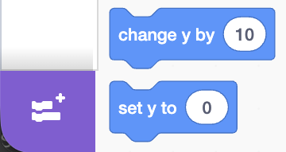
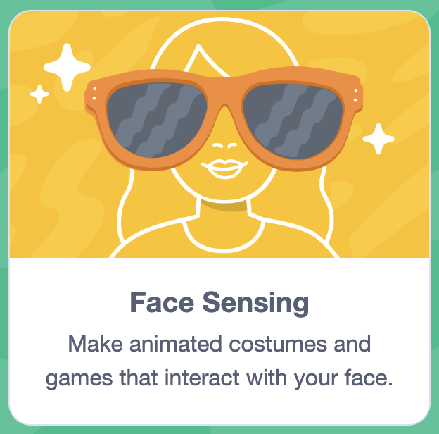

## Set up the project

You will create a new Scratch project and turn on Face Sensing so Scratch can follow parts of your face using your webcam.

--- task ---

Open [Scratch](https://scratch.mit.edu){:target="_blank"}.

Click **Create** (top left).

--- /task ---

--- task ---

Add the Face Sensing extension:

- In the bottom-left of the editor, click the **Extensions** button (purple puzzle piece)
- Click **Face Sensing**

--- /task ---

--- task ---

When your browser asks to use the camera, click **Allow**.

--- /task ---

You should now see your webcam feed on the Stage, plus a set of Face Sensing blocks in the blocks menu.
