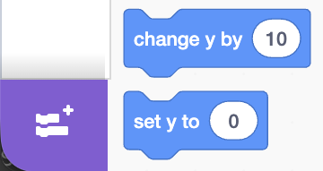
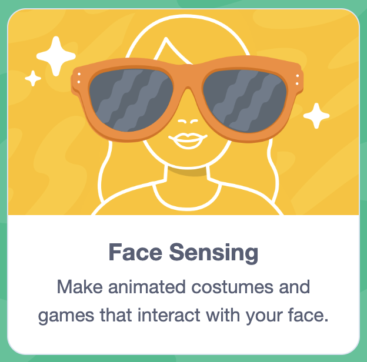

## Set up the project

Create a new Scratch project and turn on **Face Sensing** so Scratch can follow parts of your face via your webcam.

--- task ---

Open [Scratch](https://scratch.mit.edu){:target="_blank"}.

Click on **Create** (in the top left of the home page).

--- /task ---

--- task ---

Add the **Face Sensing** extension:

- In the bottom left-hand corner of the Scratch editor, click on the **Add Extension** icon (the purple icon with two blocks and a plus sign)

- Click on **Face Sensing**

--- /task ---

--- task ---

When your browser asks to use your camera, click on **Allow**.

--- /task ---

You should now see your webcam feed on the Stage, and a set of `Face Sensing`{:class="block3extensions"} blocks in the Blocks menu.
