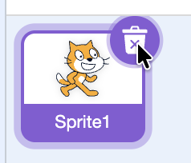
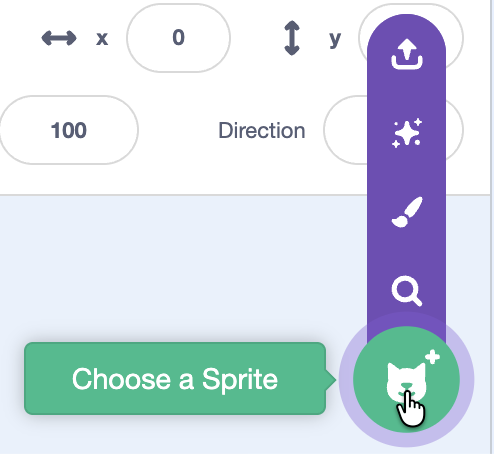
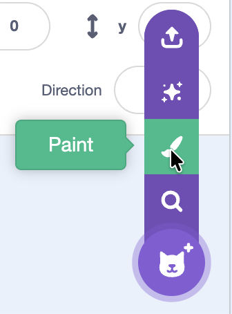

## Make a hat follow the top of your head

Pick an accessory sprite (like a hat) and make it stick to your head, resize with you, and rotate when you tilt.

--- task ---

Choose a sprite:

- Delete the default sprite (right-click the sprite > **delete**)

- Click **Choose a Sprite**
- Pick something like a **hat** (or paint your own)

--- /task ---

--- task ---

Add this code to the accessory sprite to make it follow your face:

--- /task ---

--- task ---

Test: Click the green flag and move your head around.

- Does the hat stay on your head?

--- /task ---
