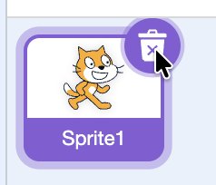
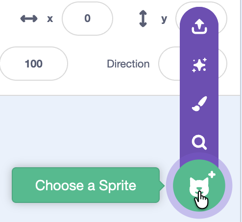
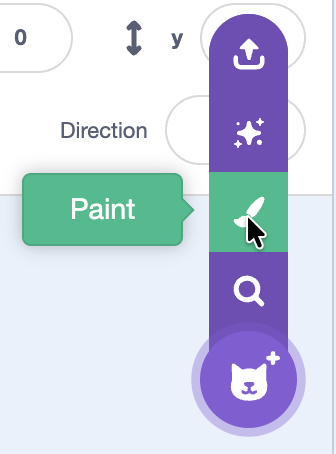

## Put a hat on your head

Choose an accessory sprite (like a hat) and make it stick to your head, resize to fit you as you move, and rotate when you tilt your head.

--- task ---

Choose a sprite:

- Delete the default sprite

- Click on **Choose a Sprite** (or paint your own sprite)
- Choose something like a **hat**

 

--- /task ---

--- task ---

Add this code to the **accessory** sprite to make it follow your face:

--- /task ---

--- task ---

**Test:** Click on the green flag and move your head around. Does the accessory stay on your head?

--- /task ---

**Tip:** To position your accessory, adjust the costume relative to its **costume center**.
