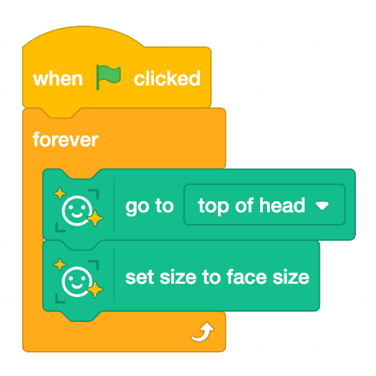
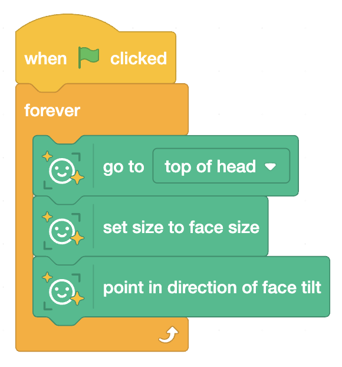

## Tilt and resize your sprite

--- task ---

Make the sprite resize with you.

If you have not already, add this inside the `forever` loop:

Tip: If it looks too big or too small, try adjusting the costume size in the costume editor, or experiment with size blocks in Scratch.

--- /task ---

--- task ---

Tilt the sprite as you tilt your head.

--- /task ---

--- task ---

Switch costumes for a “filter pack”.

Give one sprite 2 to 3 costumes, then use a key press or a click to change costume (example: `next costume`).

--- /task ---
