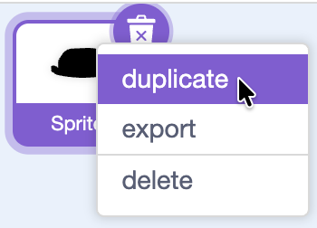
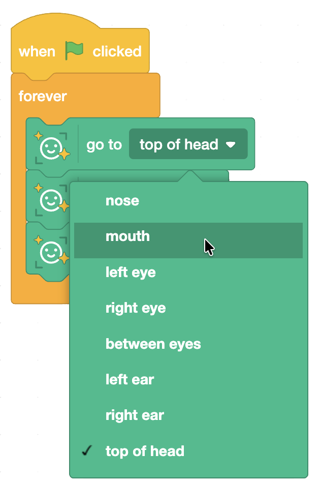

## Add nose, mouth, ears, etc

Make more accessories!

--- task ---

Duplicate your sprite:

- Right-click your hat sprite in the sprite list
- Click **duplicate**

(You could also add a new sprite if you have not painted your own.)

--- /task ---

--- task ---

Change the face feature the new sprite sticks to:

- Click the duplicated sprite
- In the code, change `top of head` to a different option (like `nose`, `between eyes`, `left ear`, or `right ear`).

--- /task ---

Try these fun combos:

- **Nose sticker** 👃
  - go to [nose v]

- **Glasses 👓**
  - go to [between eyes v]

- **Earrings** 👂
  - Make two sprites:
    - left earring: go to [left ear v]
    - right earring: go to [right ear v]
