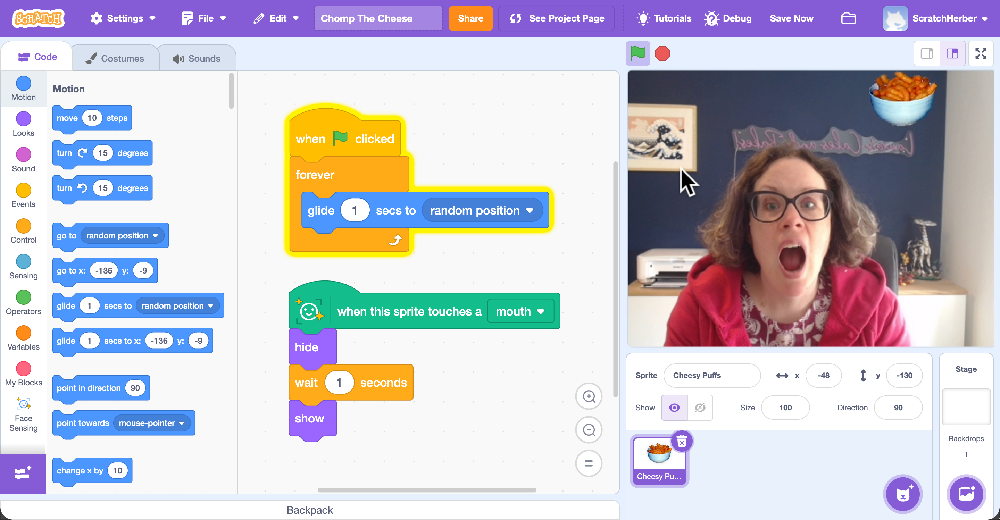

## What can you do now?

Try our [Chomp The Cheese](https://projects.raspberrypi.org/en/projects/chomp-the-cheese) project where you will create your own game using Face Sensing Blocks, in which you have to catch and eat moving cheesy puffs by using your webcam to track the movements of your mouth.

--- print-only ---

--- /print-only ---

--- no-print ---

  <iframe allowtransparency="true" width="485" height="402" src="https://scratch.mit.edu/projects/embed/1276121896/?autostart=false" frameborder="0" scrolling="no"></iframe>
  

--- /no-print ---

Or, why not try out another [Scratch](https://projects.raspberrypi.org/en/projects?software%5B%5D=scratch) project?
